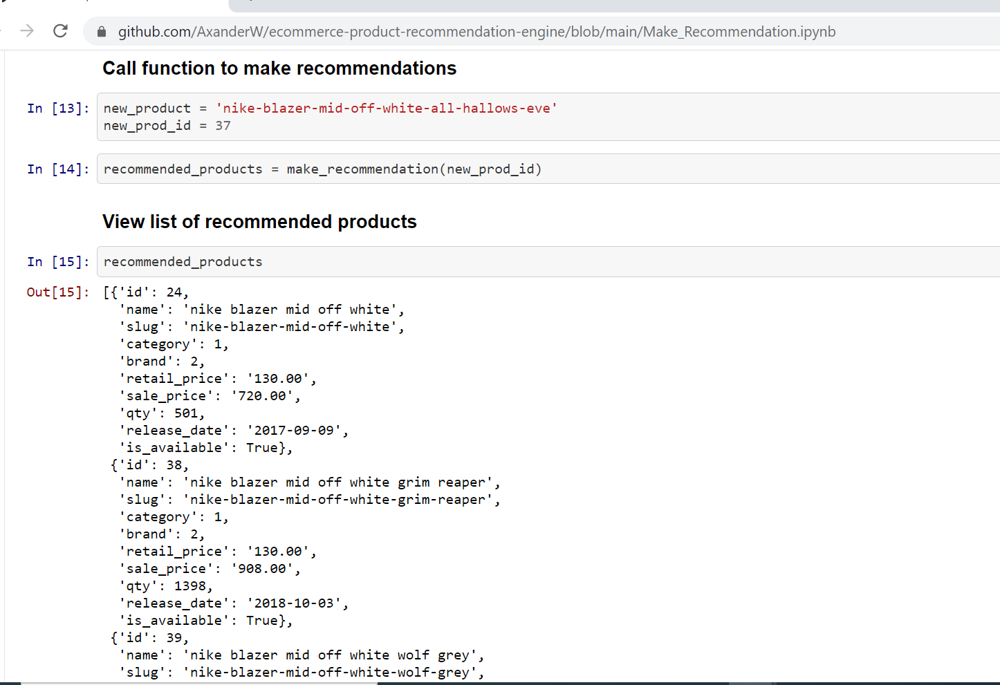

# Product Recommendation Engine 

## Background

The purpose of this project is to build a product recommendation engine to integrate with the backend REST API and frontend e-commerce website. 

## Overview

The Product Recommendation Engine was built using SKlearn's Count Vector and Cosine Similiarity machine learning models.

## Application Features

### Recommend three similiar products based on the customer's view and/or purchase history

